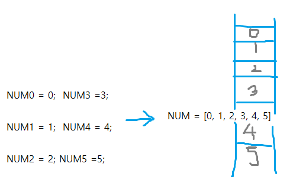
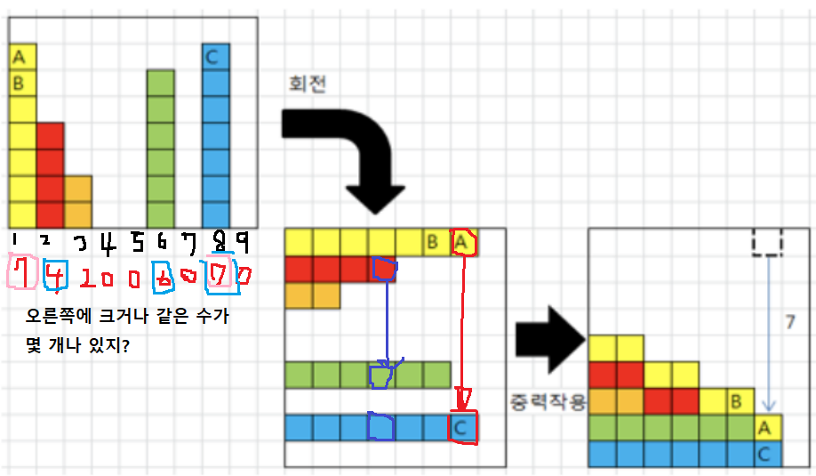

# 알고리즘
=> 의사코드와 순서도
=> 보다 좋은 알고리즘을 이해하고 활용하는 것

### 좋은 알고리즘이란?
1. 정확성: 입력과 출력을 정확히 계산 ★
2. 작업량
3. 메모리 사용량
4. 단순성
5. 최적성

#### 시간복잡도
#### 빅-오(O) 표기법 
- 시간 복잡도 함수 중 가장 큰 영향력을 주는 n에 대한 항만을 표시

## 배열 
- 일정한 자료형의 변수들을 하나의 이름으로 열거하여 사용하는 자료구조

### 1차원 배열
[Gravity]

## 정렬
### 버블 정렬
- 인접한 두 개의 워노를 비교하며 자리를 계속 교환하는 방식
- 첫 번째 원소(0)부터 인접한 원소끼리 계속 자리를 교환하면서 맨 마지막 자리까지 이동
-한 단계가 끝나면 가장 큰 원소가 마지막 자리(N-1)로 정렬