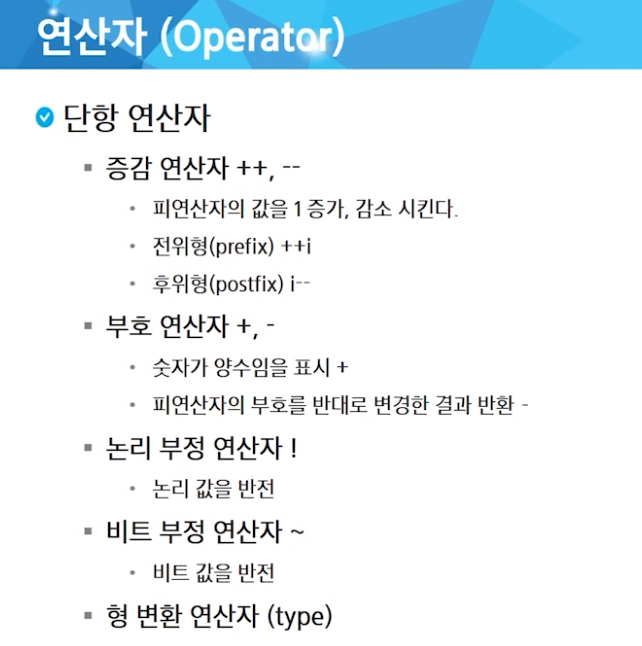
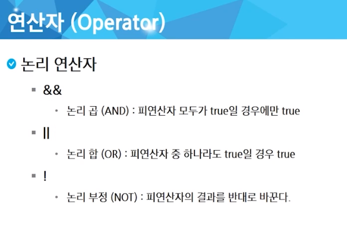
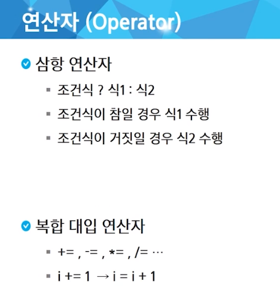
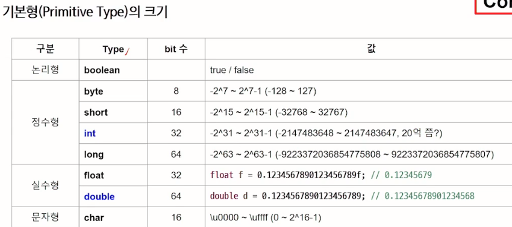
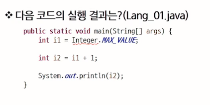
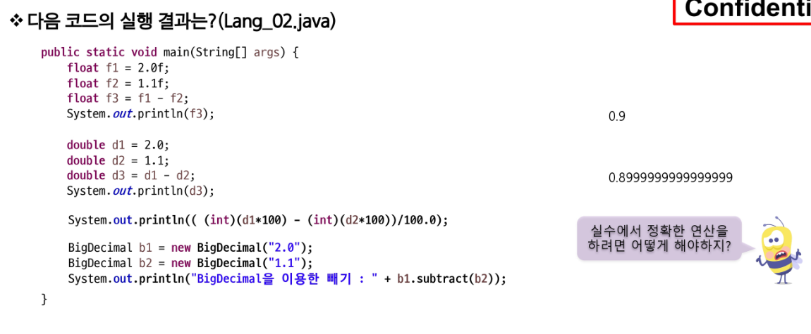
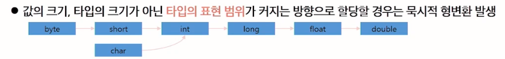
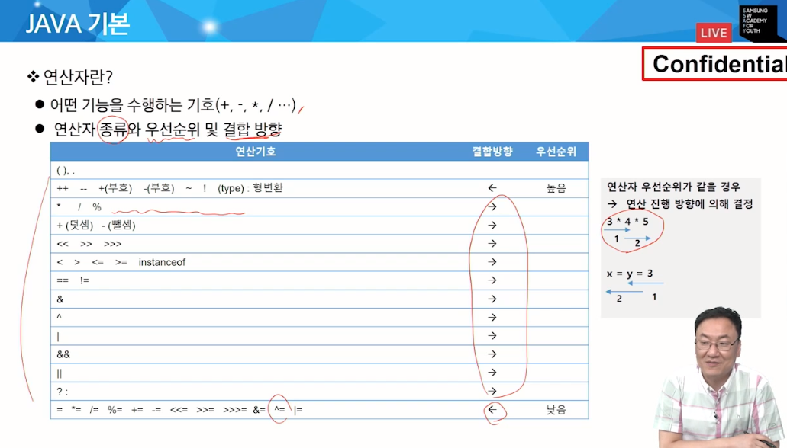

# 비전공 자바 
JAVA는 파일명과 클래스명을 일치시켜야 한다 (* java 컴파일러 요구 사항)
```java
import java.lang.*;
public class Hello {
    public  static void main(String[] args) {
        System.out.println("Hello SSAFY!!");
    }
}
```
1. import java.lang.*; 
- JAVA의 기본적인 클래스들(lang에 위치) 모두(*) 가져오기
2. public class Hello{ } 
- Hello라는 이름의 public class 정의 
3. public static void main(String[] args) {}
- Java 프로그램이 시작되는 진입점(entry point)을 나타내는 메서드
- public : 메서드가 어디서든 접근 가능
- static : 메서드가 클래스 수준에 존재, 객체 생성 없이 호출 가능 
- void : 메서드가 반환하는 값이 없음
- main : 메서드의 이름 
- String[] args: 문자열 배열로 프로그램 실행 시 커맨드 라인에서 전달되는 매개변수 저장
4. System.out.println("Hello SSAFY!!"); 
- System.out : 표준 출력 장치
- println: 괄호 안에 있는 내용 출력 메서드
```
Eclipse 사용법
* ctrl + space : 자동완성 검색
* ctrl + / : 주석 -> 여러 줄 주석은 블록 선택 후 ctrl + shift + /
* ctrl + F11 : 실행
* 
```
## 출력문
1. print
2. println : 알아서 줄바꿈 추가 (new line)
3. printf : f-string 


## 연산자
1. 단항 연산자

```java
package java_01.intro;

public class Hello {
	// ctrl + space : 자동완성
	public static void main(String[] args) {
		int a = 5;
		System.out.println(a++); // 5, a 출력 후 1증가
		System.out.println(++a); // 7, 위의 6에서 1증가한 7출력
		System.out.println(--a); // 6
		System.out.println(a);  // 6
		System.out.println(a--); // 6, 이전 값 출력 후 1 감소 -> a는 5가 됨
		System.out.println(a++); // 5 출력 후 1 증가시킨다 
		
		System.out.println(-a); // -6 
		System.out.println(~a); // -6에 대한 비트 연산 -> -7
		
		System.out.println(!false); // true
	}
}
```
2. 계산 연산자 
3. 비교 연산자
4. 논리 연산자

5. 삼항 연산자 와 복합 연산자



## 조건문
```java
// if문
if (조건식) {
    실행문1;
    실행문2; 
} else if (조건식2) {
    실행문3
} else  {
    실행문4
}
// switch문 
switch(수식) {
    case 값1:
        실행문 1;
        break;
    case 값2:
        실행문 2;
        break;
    case 값3:
        실행문 3;
        break;    
}
```
- switch 문 이용하여 윤년 달력 만들기 가능

## 반복문
```java
for (1. 초기화식; 2. 조건식; 4. 증감식) {
    3. 반복 수행할 문장
}
```
- 초기화는 반복문이 시작될 때 딱 한번만 실행
- 조건식이 false면 반복문 종료
- 증감식은 반복문의 반복이 끝나면 실행됨
- 초기화식, 증감식은 (,)을 이용하여 둘 이상 작성 가능
- 필요하지 않은 부분은 생략 가능, for(;;) 무한 루프
- 반복횟수를 알 때 사용
```java
while (1. 조건식) {
    2. 반복 수행할 문장;
}
```
- 조건식이 true일 경우 계속해서 반복 == 조건식이 거짓이 될 때까지 반복 수행
- 조건식 생략 불가능
```java
do {
    1. 반복 수행할 문장;
} while (2. 조건식;)
```
- 블록 내용 먼저 수행 후 조건식 판단 (최소 한번은 수행)
- 조건식이 true면 계속해서 반복

### break & continue
- 파이썬의 것과 유사하나.... 
- 반복문에 이름(라벨링)을 붙여 제어 가능
```java
out for () {
    for () {
        break out
    }
}
```
- 위의 경우 out for 문이 끝나버린다!
- 그외는 파이썬처럼 블록 단위로 사용된다

---

# JAVA 기본 문법
## Variable
- 자료를 저장하는 메모리 공간
- 타입에 따라 크기가 달라진다 (값 x)
### Type
1. 기본형 : 미리 정해진 크기의 데이터 표현, 변수 자체에 값 저장
2. 참조형 : 미리 정해질 수 없는 데이터 표현, 변수에는 실제 값을 참조하는 주소만 저장

#### 기본형

##### 정수형
- byte가 8bit지만 2^7까지만 처리하는 이유? 
- 맨 앞은 부호를 나타내는 sign bit이기 때문이다. 
- sign bit를 통해 음수와 양수를 표현한다. 
##### 실수형
- float과 double은 정밀도에서 차이가 난다.

----

- Integer = int의 wrapper class
- 코드 실행 결과 : 최댓값 + 1 이므로 overflow가 일어난다.
- 필요한 수의 크기를 고려해 int 또는 long등의 타입 선택
----

- 실수의 연산은 부정확하다.
- 유효 자리수를 이용한 반올림 처리 필요
---
#### 형변환

- primitive는 primitive끼리, reference는 reference끼리 형 변환 가능
- boolean은 다른 기본 형과 호환되지 않는다.
- 형 변환을 위해서 wrapper class 사용
```java
double d = 100.5;
int result = (int)d;
```
- 형 변환 연산자 (괄호) 사용
- 큰집의 데이터를 작은집으로 형 변환시킬 때 값 손실이 발생할 수 있다.
- 값 손실이 발생할 때는 명시적 형 변환을 이용한다.
- 타입의 표현 범위가 커지는 방향으로 할당하면 묵시적 형변환 발생(형변환 연산 생략)

- 연산자 우선순위 참고
- 산술 이항 연산자는 연산 전에 피연산자의 타입을 일치시킨다.
- 피연산자의 크기가 4byte(int)미만이면 int로 변경한 후 연산 진행
- 두 피연산자 중 큰 타입으로 형 변환 후 연산 진행
```java
// error : type mismatch
package java_01.intro;

public class Operator {
	public static void main(String[] args) {
		byte b1 = 10;
		byte b2 = 20;
			byte b3 = b1 + b2;
		
		int i1 = 10;
		long l1 = 20;
			int i2 = i1 + l1; 
		
		float f1 = 10.0f;
		float f2 = f1 + 20.0;
	}
}

// resolve
package java_01.intro;

public class Operator {
	public static void main(String[] args) {
		byte b1 = 10;
		byte b2 = 20;
			byte b3 = (byte) (b1 + b2);
		
		int i1 = 10;
		long l1 = 20;
			int i2 = (int) (i1 + l1); 
		
		float f1 = 10.0f;
		float f2 = (float) (f1 + 20.0);
	}
}

```

#### 비교연산자
```java
package java_01.intro;

public class Lang_operator2 {
	public static void main(String[] args) {
		int a = 10;
		int b = 20;
		System.out.println((a > b) & (b > 0)); // and 연산 -> false
		
		System.out.println((a += 10) > 15 | (b -= 10) > 15); // or 연산 -> true
		System.out.println("a = " + a + ", b = " + b); // a = 20, b = 10
		
		a = 10;
		b = 20;
		System.out.println((a += 10) > 15 || (b -= 10) > 15);
		System.out.println("a = " + a + ", b = " + b);
	}
}
```
- &&와 ||는 short-cut 단축 평가를 지원한다.
- 만약 a, b를 다시 10과 20으로 재할당하지 않으면 a는 30으로 값이 계산되나 b는 조건식이 실행되지 않고 10의 값을 유지한다.

#### 조건문
- switch문 case가 맞는 값이면 break 나올 때까지 남은 case문마다 반복 실행됨
```java
package java_01.intro;

import java.util.Random;

// 100번 주사위를 던진 결과의 합과 평균값(소수점 1자리) 출력하는 코드
public class Lang_operator3 {
	public static void main(String[] args) {
		int sum = 0;
		int cnt = 100;
		double avg = 0;
		Random rand = new Random();
		
		for (int i = 0; i < cnt; i++) {
			
			sum += rand.nextInt(6) + 1;
			
		}
		
		avg = 1.0 * sum / cnt ;
		
		System.out.printf("sum : %d, avg: %.1f%n", sum, avg );
	}
}
```