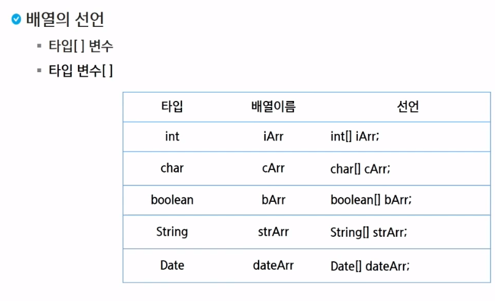
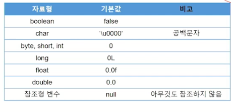

# 비전공 자바 배열
## 배열
- 같은 종류의 데이터를 저장하기 위한 자료구조
- 고정된 크기, 한번 생성된 배열의 크기는 바꿀 수 없다.
- 배열은 객체로 취급된다.
- 배열의 요소를 참조하려면 배열이름과 index(음이 아닌 정수 값 : 0 과 양수)을 조합하여 사용
- index 번호는 0부터 시작
- 배열이름.length로 배열의 길이 조회 가능하며 길이는 임의로 변경 불가
- 길이 변경 필요시 새로운 배열을 생성 후 내용을 옮긴다.

- 주로 타입[] 변수 형식의 선언을 선호한다.

### 배열의 생성과 초기화
1. 자료형[] 배열이름 = new 자료형[길이];                  // 배열 생성(자료형의 초기값으로 초기화)
2. 자료형[] 배열이름 = new 자료형[] {값1, 값2, 값3, 값4}; // 배열 생성 및 값 초기화
3. 자료형[] 배열이름 = {값1, 값2, 값3, 값4};             // 선언과 동시에 초기화
- new : 객체를 생성할 때 사용되는 키워드로 클래스의 인스턴스 생성, 배열 생성, 객체 초기화에 사용 
- 1번과 2번은 new를 썼기에 재할당이 가능(값 추가)
- 배열의 크기(길이)는 고정되어 있고, 수정은 그냥 가능

### 배열 순회
- 반복문
- Arrays.toString(배열이름); // 배열 안의 값을 바로 다 볼 수 있다

### 배열 복사
- 배열은 생성 후 길이를 변경할 수 없기에 더 큰 배열을 생성하고 싶으면 이전 배열 값을 복사 해야 한다.
- Arrays.copyOf(복사할 배열, 새로운 배열 크기)
- System.arraycopy(Object src, int srcPos, Object dest, int destPos, int length)

### 다차원 배열
- 2차원 이상의 배열
- 배열 요소로 또 다른 배열을 가지는 배열
1. int [][] iArr
2. int iArr[][]
3. int[] iArr[]

# 전공
## 배열
- 동일한 타입의 데이터를 하나의 연속된 메모리 공간에 관리하는 것
### 생성
- new 키워드와 함께 데이터 타입 및 길이 지정 : new data-type[length]
### 초기화
- 배열의 생성과 동시에 대상 자료형에 대한 기본값으로 초기화 진행
- 배열 자료형보다 작은 자료형은 들어갈 수 있다. (묵시적 형변환 실행)

- 선언과 할당이 따로 있을 때는 new 자료대상형을 꼭 붙여준다.
- 배열은 최초 메모리 할당 이후, 변경할 수 없다.
