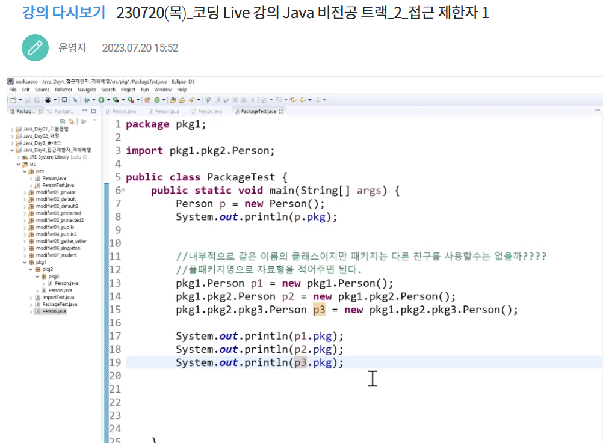

# 객체지향 프로그래밍(OOP)
1. 추상화(Abstraction) : 현실의 객체를 추상화해 클래스 구성
2. 다형성(Polymorphism): 하나의 객체를 여러 타입(형)으로 참조 가능
3. 상속(Inheritance): 부모 클래스의 자산을 물려받아 자식을 정의해서 코드의 재사용 가능
4. 데이터 은닉과 보호(Encapsulation): 데이터를 외부에 직접 노출시키지 않고 메서드를 이용해 보호 가능
- 객체란?
    - 주체가 아닌, 주체가 활용하는 것으로 사물, 개념, 논리 등이 있다 
    - 따라서 객체지향 프로그래밍은 주변의 많은 것들을 '객체화'하여 프로그래밍하는 것 
- 클래스: 객체를 만드는 설계도
- 인스턴스: 클래스를 통해 생성된 객체

## 객체지향 프로그래밍의 장점
- 블록 형태의 모듈화된 프로그래밍
    - 신뢰성 높은 프로그래밍
    - 추가/수정/삭제 용이
    - 높은 재사용성

---
## 클래스와 오브젝트
### 클래스
- 현실의 객체가 갖는 속성과 기능은 추상화되어 클래스에 정의된다.
- 클래스는 구체화되어 프로그램의 '객체'가 된다.
- 클래스는 객체를 정의해 놓은 것으로 객체를 생성할 때 사용되는 데이터 타입.
``` 
[클래스 구성]
1. 속성(필드): 멤버 변수
2. 동작: 메소드
3. 생성자
4. 중첩 클래스(클래스 내부의 클래스)
```
#### 클래스 선언

### 객체
- 클래스를 구체화한 것으로 실제로 동작하는 것
- 메모리에 생성된 데이터
---
## JVM 메모리 구조
- 자바는 메모리 관리를 개발자가 직접 하지 않는다.
- GC(garbage collection)이 메모리 관리 
1. metaspace
    - 클래스 정보 관리
        - 타입, field, method
2. stack
    - 메서드들의 실행 공간
        - thread 별로 별도 관리
        - 메서드 호출 마다 메서드 프레임 적층
        - 메서드 프레임에 로컬변수도 쌓이는 구조
        - stack은 바로 삭제 (gc로 정리 x)
3. heap 
    - 객체를 저장하는 영역
        - thread에 의해 공유
        - 객체가 생성되고 garbage collection에 의해 정리됨
        - 상수 풀
---
## 변수 
### 선언 위치에 따른 분류
#### 멤버 변수
1. 클래스 변수
- 클래스 영역 선언(static 키워드) : 클래스 당 하나의 메모리 공간만 
- 생성시기: 클래스가 메모리에 올라갔을 때
- 모든 인스턴스가 공유
- heap에 클래스별로 생성
- 클래스가 언로드되면 GC 발생
2. 인스턴스 변수
- 클래스 영역 선언(non-static) : 각각의 메모리 공간을 가짐 
- 생성시기: 인스턴스가 생성되었을 때(new)
- 인스턴스 별로 생성됨
- heap에 객체 별로 고유한 상태(stateful)
- GC에 의해 없어질 때 소멸

#### 지역변수
3. 지역 변수
- 클래스 영역 이외(메서드, 생성자 등 . . . )
- 생성시기: 선언되었을 때 
- 함수 내부: 지역 변수, 함수 선언부: 파라미터 변수
- stack의 메서드 프레임 내부에 생성 
- 사용하기 전 명시적 초기화 필요
- 외부에서는 접근 불가능
- 선언된 영역을 벗어나면 소멸
---
## 메소드
- 객체가 할 수 있는 행동을 정의(동작을 프로그래밍화)
- 어떤 작업을 수행하는 명령문의 집합에 이름을 붙여 놓은 것
- 메소드의 이름은 소문자로 시작하는 것이 관례
- 선언시 {} 안에 메소드가 할 일을 정의
- 반복적으로 사용되는 코드의 중복 방지
### 메소드 호출
- 호출한 메소드가 선언되어 있는 클래스에 접근 : '클래스객체.메소드이름' 으로 호출
- 매개변수: 메소드에서 사용하는 것
- 인자: 호출하는 쪽에서 전달하는 것
- 리턴 타입: 아무 것도 리턴하지 않을 경우 void, 결과를 받을 때 묵시적 형변환 적용
- 리턴 타입은 하나만 적용 가능
#### variable arguments
- 동일한 타입의 인자가 몇개나 들어올지 예상할 수 없는 경우(가변적)
- '...'을 이용해 파라미터를 선언하면 호출 시 넘겨준 값의 개수에 따라 자동으로 배열 생성 및 초기화
```java
public void variableArgs(int... params){
    int sum = 0;
    for (int i:params) {
        sum += i;
    }
    System.out.println(sum);
}
```
### 메소드 오버로딩
- 이름이 같고 매개변수가 다른 메소드를 여러 개 정의
- 동일한 기능을 수행하는 메서드의 추가 작성
- ex) println(parameter) : 들어갈 parameter 각 종류 별로 처리 -> 파라미터 개수, 순서, 타입 등이 달라야 한다!! 
- 중복 코드에 대한 효율적 관리 가능
- 리턴 타입은 의미가 없다
---
## 생성자
- new 키워드로 객체 생성
- 생성자는 클래스명과 동일하며 결과형 리턴값을 갖지 않는다.
- 객체가 생성될 때 반드시 하나의 생성자 호출
- 멤버필드의 초기화에 주로 사용
- 클래스 내부에 생성자를 정의한 적이 한 번도 없으면 컴파일러가 기본 생성자가 있는 것으로 인지
- 생성자 오버로딩이 가능하다.
- 파라미터가 있는 생성자는 호출 시 값을 넘겨줘야 하고, 해당 생성자를 작성하면 JVM에서 기본 생성자를 추가하지 않음
### this
- 참조 변수로서 객체 자신을 가리킴
- 자신의 멤버 접근 가능
- 생성자 내에서 항상 첫번째 구문에 위치
---
## 패키지
- 프로그램의 많은 클래스를 관리하기 위해 이용(파일 폴더 느낌)
- 클래스와 관련된 인터페이스들을 모아두는 이름 공간
- 패키지의 구분은 '.(dot)' 연산자 이용
- 패키지의 이름은 시중에 나와있는 패키지들과 구분되게 지어야 한다.
- 일반적으로 소속이나 회사의 도메인 사용


### 임포트
- 다른 패키지의 클래스를 사용하기 위해 필요한 과정
```java
import java.util.*
```
- util안의 패키지들을 전부 가져오지만...
- 패키지 밑의 하위 패키지까지 가져오지 않는다.
---
## 캡슐화(Encapsulation)
- 객체의 속성(fields)과 행위(methods)를 하나로 묶고 외부에 감춘다.
### 접근 제한자
- 클래스, 멤버 변수, 멤버 메서드 등의 선언부에서 접근 허용 범위를 지정하는 역할의 키워드
1. public : 모든 위치에서 접근 가능
2. protected : 같은 패키지에서 접근 가능, 다른 패키지는 상속 관계가 있을 때만 접근 가능
3. (default) : 같은 패키지에서만 접근 가능, 접근제한자가 선언 안 되어있을 경우 기본적으로 적용
4. private : 자신의 클래스에서만 접근 가능

### 접근 제한 : 메서드 이용
- 외부에 값을 노출
- setter(설정자): set멤버변수명(ex: setName) - 값을 설정하거나 변경
- getter(접근자): get멤버변수명(ex: getName) - 값을 반환하거나 가져와 읽는데 활용
---
## 싱글턴 패턴
- 생성자가 여러 차례 호출되어도 실제로 생성되는 개체는 하나이고 최초 생성 이후에 호출된 생성자는 최초의 생성자가 생성한 객체를 리턴