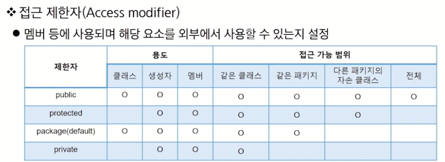

# 이전 진도
## 생성자
- 객체를 생성할 때 호출되는 메서드 비슷한 것
    - new 키워드와 함께 호출하는 것
    - 일반 멤버 변수의 초기화나 객체 생성 시 실행돼야 하는 작업 정리
- 메서드와 비슷하나 리턴 타입이 없고 이름은 클래스 이름과 동일
```
제한자 클래스_명(타입 변수_명, 타입 변수_명...)      -> 선언부
{
    /// 멤버 변수 초기화 작업                       -> 구현부
}
```
### default constructor
- 파라미터가 없고 구현부가 비어있는 형태
- 별도의 생성자 코드가 없으면 컴파일러가 기본 제공
### parameter가 있는 constructor
- 일반 멤버 변수의 초기화가 목적 : 생성자 호출 시 값을 넘겨줘서 초기화
- 파라미터가 있는 생성자를 만들면 기본 생성자는 추가되지 않는다.

---
## this
- 참조 변수로써 객체 자신을 가리킴 
- 명시적으로 멤버임을 나타냄
- this는 객체에 대한 참조이므로 static 영역에서는 사용 불가
    - main 안에서 사용 불가
- 생성자 오버로딩 가능 
    - 생성자 별 코드의 중복 제거
- 반드시 첫 줄에서만 호출 가능
---
## 초기화블록(Initializer)
- 멤버 변수의 초기화(생성자와 같은 역할)


---
# OOP - Inheritance
- OOP is A P.I.E (추상화, 다형성, 상속, 은닉)
## 상속
- 기존 클래스의 자산(멤버)을 자식(하위) 클래스에 재사용하는 것
    - 상위 클래스의 생성자와 초기화 블록은 상속하지 않는다
- extends 키워드 사용
```java
public class Person {
    String name;
    void eat();
    void jump();
}

public class SpiderMan extends Person {
    boolean isSpider;
    void fireWeb(){}
}
```
## Object 클래스
- 모든 클래스의 조상 클래스
- 별도의 extends 선언이 없는 클래스들은 extends Object가 생략됨
- 모든 클래스에서는 Object 클래스에 정의된 메서드가 있음
- ex) java.lang.Object
---
## 다양한 상속 관계
- 상속의 관계는 is a (kind of) 관계라고 함
    - Person is a Object, SpiderMan is a Person
### 단일 상속
- 자바는 단일 상속만 지원
    - 하나의 부모만 있을 수 있다
    - interface와 포함 관계(has a)로 단점 극복
#### 포함 관계
- 상속 이외에 클래스를 재활용하는 방법
- 2개 이상의 클래스에서 특성을 가져올 때 하나는 상속, 나머지는 멤버 변수로 처리
- 어떤 클래스를 상속 받고 어떤 클래스를 포함할지? -> 문법이 아니라 프로젝트 관점의 문제

---
## 메서드 재정의
### 메서드 오버라이딩
- not 오버로딩(추가 적재 -> 자동완성에 여러 개가 보임)
- 오버라이딩(위에다 덮어쓰기 -> 자동완성에 마지막으로 만들어진 것만 보임)
- 조상 클래스에 정의된 메서드를 자식 클래스에 적합하게 수정하는 것 
```
[조건]
1. 메서드 이름이 같아야 한다.
2. 매개 변수 개수, 타입, 순서가 같아야 한다.
3. 리턴 타입이 같아야 한다.
4. 접근 제한자는 부모 보다 범위가 넓거나 같아야 한다.
5. 조상보다 더 큰 예외를 던질 수 없다.
```
---
## super 키워드
- super를 통해 조상 클래스 멤버에 접근
- 변수의 scope(범위)
    - 사용된 위치에서 점점 확장해가며 처음 만난 선언부에 연결됨
    - method 내부 > 해당 클래스 멤버 변수 > 조상 클래스 멤버 변수
- super(): 조상 클래스의 생성자 호출
```java
public SpiderMan() {
    super();
}
```
    - 명시적으로 this, super를 호출하지 않으면 default constructor 안에 언제나 super();가 생략되어 있다.
- super 생성자 호출도 언제나 맨 첫 줄에 있어야 한다.
---
## Annotation
- 컴파일러, JVM, 프레임워크 등이 보는 주석
- 소스코드에 메타 데이터를 삽입하는 형태(라벨)

### JDK 1.5의 기본 주석 예시
1. @Deprecated : 이제 이 메서드 안 써줬음 해요 
2. @Override : 오버라이드 규칙 잘 지켰는지 검증 
3. SuppressWarnings 
---
### 패키지와 임포트
- 패키지 naming: 소속.프로젝트.용도
- 임포트: 다른 패키지에 선언된 클래스 사용하기 위한 키워드
- 임포트 패키지명.클래스명; 
- 임포트 패키지명.*;
---
## 제한자(modifier)
- 클래스, 변수, 메서드 선언부에 함께 사용되어 부가적 의미 부여
- 접근 제한자 : 하나만 사용 가능, 해당 요소를 외부에서 사용할 수 있는지 설정

- 그외 제한자
    - static: 클래스 레벨의 요소 설정
    - final: 요소를 더 이상 수정할 수 없게 함 -> 상속 금지, 오버라이딩 방지 
        - blank final : 값이 할당되지 않은 멤버 변수, 모든 객체는 같은 값을 사용해야 함, 생성자에서 1회 초기화 가능
        - static final: 
    - abstract: 추상 메서드 및 추상 클래스 작성
