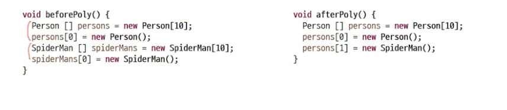
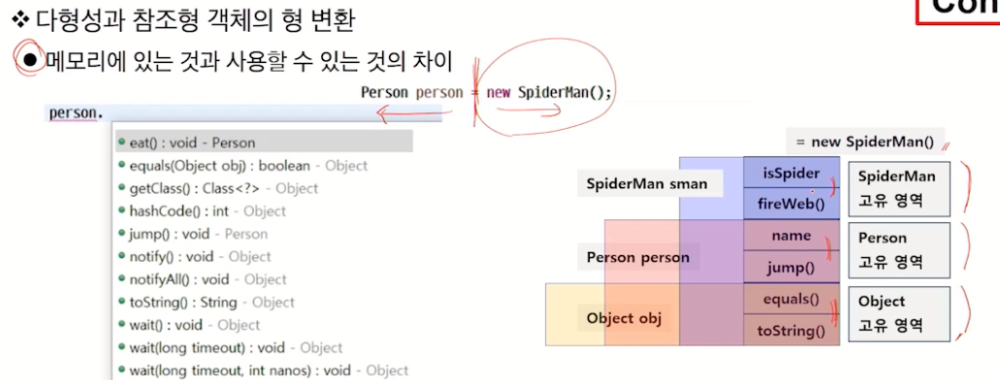

# OOP 
## Encapsulation
- 데이터 은닉과 보호
- 변수를 private 접근으로 막기
- 공개되는 메서드를 통한 접근 통로 마련 : setter/getter
    - 외부에서 변수에 직접 접근하면 보호할 수 없었는데 메서드를 통해 보호 로직 추가 가능
---
## Singleton 디자인 패턴
- 객체의 생성을 제한할 필요가 있을 때 사용
    - 여러 개의 객체가 필요 없을 경우
        - 객체를 구별할 필요가 없다
        - 수정 가능한 멤버 변수가 없고 기능만 있는 경우
        - stateless한 객체
    - 객체를 계속 생성/삭제하는데 많은 비용이 들어서 재사용이 유리한 경우
= 객체를 하나 만든다. (두 개를 만들지 못 하게 한다)

### sigleton 만들기
- 외부에서 생성자에 접근 근지 : 생성자 접근 제한자 private 설정
- 내부에서는 접근 가능하므로 직접 객체 생성
- 외부에서 private member에 접근 가능한 getter 생성 : 객체 없이 접근 가능하도록 static 변수에 추가, setter는 불필요하다 

---
## 다형성 Polymorphsim
- 하나의 객체가 많은 형(타입)을 가질 수 있는 성질
- '상속 관계'에서 조상클래스의 타입으로 자식 클래스 객체를 레퍼런스할 수 있다.
- 하나의 객체를 다른 타입으로 참조할 수 있다!!
- 즉, 다형성으로 다른 타입의 데이터를 하나의 배열로 관리할 수 있다. 타입 별로 배열을 다 안 만들어도 된다는 말씀! 

- 다형성 활용 1 ) 다른 타입의 객체를 다루는 배열 
- 객체가 아닌 기본형은? wrapper class를 이용해 기본형을 객체로 다룰 수 있다. 
- 다형성 활용 2 ) 매개변수의 다형성
- 메서드가 호출되기 위해서는 메서드와 파라미터가 맞아야 하는데 Object를 파라미터로 처리하여 객체의 타입에 따라 메서드를 만들 필요가 없어진다.

### 객체의 형 변환
```java
Person person = new SpiderMan();
```
- 메모리에 있는 것과 사용할 수 있는 것의 차이

#### 참조형 객체의 형 변환
- 하위 타입을 상위 타입으로 변환 : 묵시적 
    - 자손 타입의 객체를 조상 타입으로 참조 : 형 변환 생략 가능 -> 조상의 모든 내용이 자식에 있기 때문
- 상위 타입을 하위 타입으로 변환 : 명시적
    - 조상 타입을 자손 타입으로 참조 : 형 변환 생략 불가

### instanceof 연산자
- 실제 메모리에 있는 객체가 특정 클래스 타입인지 논리 연산 리턴

### 참조 변수의 레벨에 따른 객체의 멤버 연결
#### 정적 바인딩
- 컴파일 단계에서 참조 변수의 타입에 따라 연결이 달라짐
- 객체의 멤버 변수가 중복/ static method
#### 동적 바인딩
- 다형성을 이용해 메서드 호출이 발생할 때 runtime에 메모리의 실제 객체의 타입으로 결정(그때 그때 바뀜)
- 객체의 instance method가 재정의되었을 때 마지막에 재정의된 자식 클래스의 메서드가 호출됨
    - 최대한 메모리에 생성된 실제 객체의 최적화된 메서드가 동작
