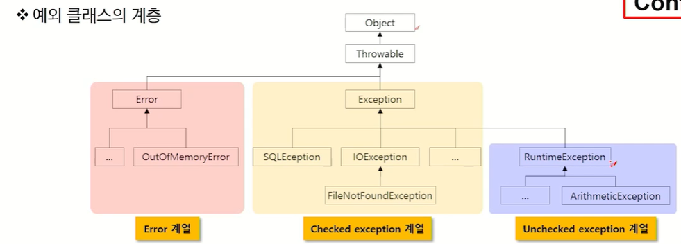
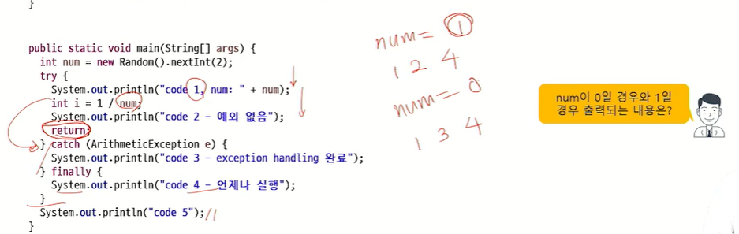
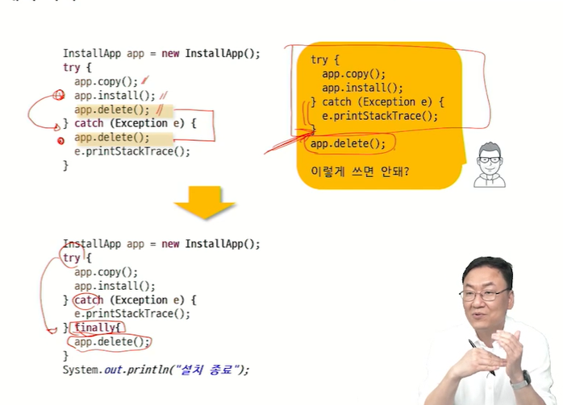
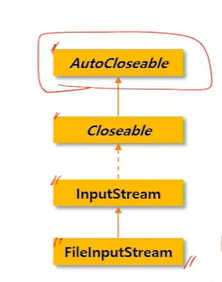
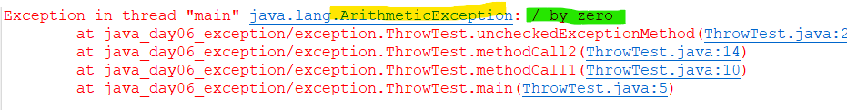
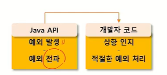

# Exception
## 에러와 예외
- 어떤 원인에 의해 오동작하거나 비정상적으로 종료되는 경우
- 심각도에 따른 분류
    - Error
        - 메모리 부족, stack overflow와 같이 일단 발생하면 복구 불가
        - 프로그램의 비정상적 종료를 막을 수 없어 디버깅 필요
    - Exception
        - 읽으려는 파일이 없거나 네트워크 연결이 안 되는 등 수습 가능한 비교적 상태가 약한 것들
        - 프로그램 코드에 의해 수습 가능
- exception handling(예외 처리)
    - 예외 발생 시 프로그램의 비정상 종료를 막고 정상적인 실행 상태를 유지하는 것
    - 예외의 감지 및 예외 발생 시 동작할 코드 작성 필요
---
## 예외 처리
- 예외 클래스의 계층 

### checked exception
- 예외에 대한 대처 코드가 없으면 컴파일이 진행되지 않음
### unchecked exception(RuntimeException 하위 클래스)
- 예외에 대한 대처 코드가 없더라도 컴파일이 진행됨
- 컴파일러가 예외 대처 코드가 있는지 없는지를 체크한다
---
## try~catch 구문
```java
try {
    // 예외가 발생할 수 있는 코드
} catch(XXException e) {
    // 예외 발생했을 때 처리 코드
}
```
### Exception 객체의 정보 활용
- Throwable의 주요 메서드
    1. public String getMessage(): 예외에 대한 구체적인 메시지 반환
    2. public Throwable getCause(): 예외의 원인이 되는 Throwable 객체 또는 null 반환
    3. public void printStackTrace(): 예외가 발생된 메서드가 호출되기까지의 메서드 호출 스택을 출력, 디버깅 수단으로 주로 사용
- try 블록에서 예외가 발생하면
    - JVM이 해당 Exception 클래스의 객체 생성 후 thorw : throw new XXException
- 던져진 exception을 처리할 수 있는 catch 블록에서 받은 후 처리 
    - 적당한 catch 블록을 만나지 못하면 예외처리 실패
- 정상적으로 처리되면 try-catch 블록을 벗어나 다음 문장 진행
- try 블록에서 어떠한 예외도 발생하지 않은 경우, catch문을 거치지 않고 try-catch 블록의 다음 흐름 문장을 실행
- try 블록 하나에 여러 개의 catch 블록 추가 가능 : 예외 종류별로 catch 블록 구성
    - 상위 Exception 클래스를 하위 블록으로 적는다
    - 상속 관계를 잘 생각하며 작성!
- 다중 catch 문장 작성 순서 유의 사항
    - JVM이 던진 예외는 catch문장을 찾을 때 다형성 적용, 작은 범위에서 큰 범위로 갈 것!

### 다중 예외 처리를 이용한 CheckedException 처리
- 발생하는 예외들을 상황 별로 처리하는 것을 권장
- 하지만, 심각하지 않은 예외를 굳이 세분화해 처리할 필요도 없다
    - |를 이용해 하나의 catch 구문에서 상속관계가 없는 여러 개의 exception 처리

### try~catch finally 예외 처리
- finally: 예외 발생 여부와 상관 없이 언제나 실행
- 중간에 return을 만나도 finally 블록 먼저 수행 후 리턴 실행
```java
try {
    // 예외 발생할 만한 코드 - system 자원 사용
} catch (Exception e) {
    // Exception 발생시 처리 코드
} finally {
    // try block에서 접근했던 system 자원의 안전한 원상 복구
}
```


- 생성한 시스템 자원을 반납하지 않으면 장래 resource leak 발생 가능 -> close 처리
- ex) Scanner class close 필요한 이유!
- JDK 1.7이상에서 리소스의 자동 close 처리
- try 선언문에 선언된 객체들에 대해 자동 close 호출(finally 역할) : 단, 해당 객체들이 AutoCloseable interface를 구현할 것

---
## throws 활용
- throws 키워드를 통한 처리 위임
- method에서 처리해야 할 하나 이상의 예외를 호출한 곳으로 전달
    - 예외가 없어지는 것이 아니라 단순히 전달
    - 예외를 전달받은 메서드는 다시 예외 처리의 책임 발생
```java
void exceptionMethod() throws Exception1, Exception2 ... {
    // 예외 발생 코드
}
void methodCaller() {
    try {
        exceptionMethod();
    } catch ( Exception e) {}
}
```
- 처리하려는 예외의 조상 타입으로 throws 처리 가능
- checked exception은 반드시 try~catch 또는 throws 필요
- runtime exception은 thorws하지 않아도 전달되지만 결국 try~catch로 처리

### 로그 분석과 예외 처리
- 예외 종류
- 예외 원인
- 예외 발생 위치 -> 디버깅 출발점
    - 직접 작성한 코드를 디버깅 대상으로 삼기
    - 참조 라이브러리(java.xx 등)는 과감히 스킵


### API와 throws
- API가 제공하는 메서드들은 사전에 예외가 발생할 수 있음을 선언부에 명시하고 프로그래머가 그 예외에 대처하도록 강요


### 메서드 재정의와 throws
- 메서드 재정의 시 조상 클래스 메서드가 던지는 예외보다 더 큰 상위 레벨의 예외를 던질 수 없다
    - 부모가 치지 않은 사고를 자식이 칠 수 없다

### 예외 변환
- 하위 계층에서 발생한 예외는 상위 계층에 맞는 예외로 바꿔서 thorw해야 한다
- Exception Chaining
    - 하위 계층에서 발생한 예외 정보가 상위 계층의 예외를 디버깅하는데 유용할 경우 사용
        - 하위 계층의 예외를 원인으로 상위 계층에서 예외가 발생
