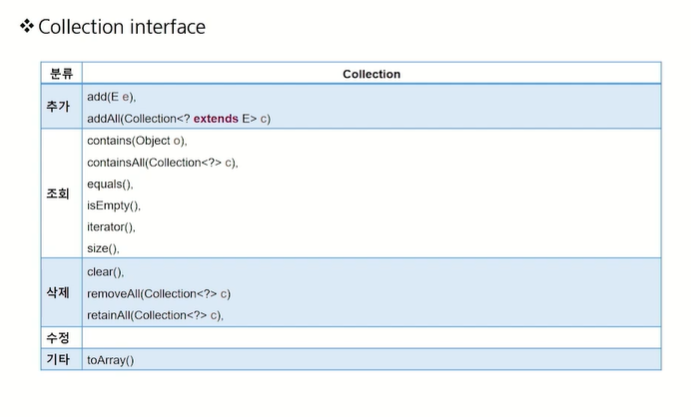
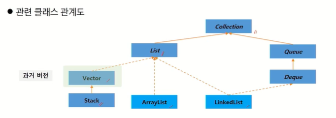
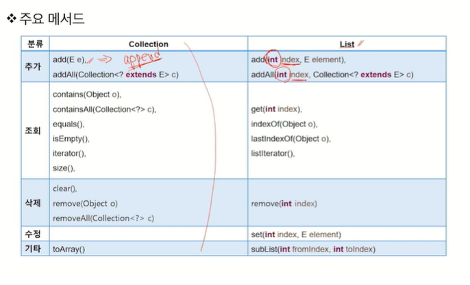
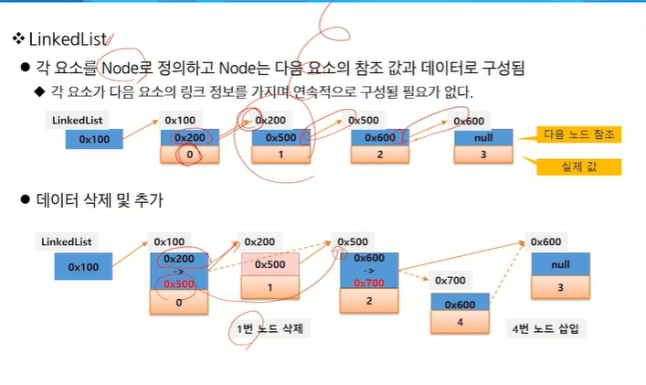
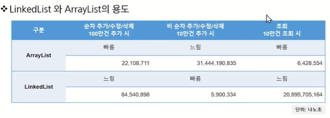
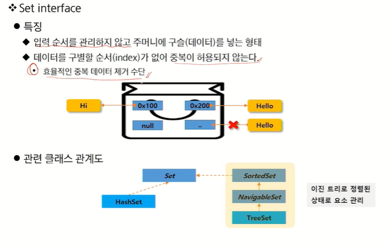
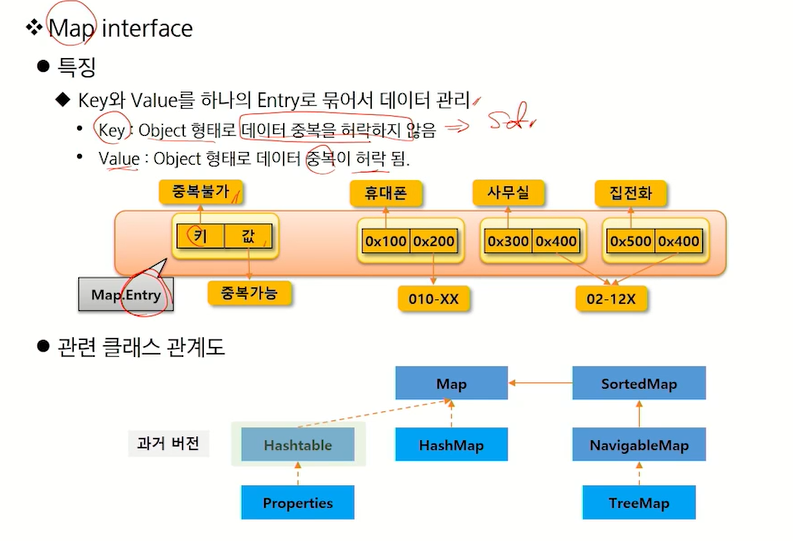
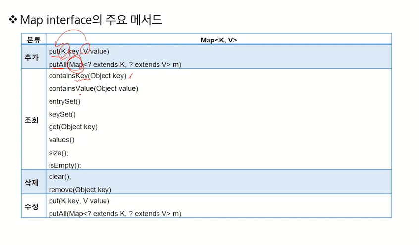

# Collection
- 자료구조: 데이터 값의 모임, 데이터 간의 관계, 데이터에 적용할 수 있는 함수나 명령
- 데이터베이스 DB와 비슷함
## 배열
- 가장 기본적인 자료 구조
- homogeneous collection : 동일한 데이터 타입만 관리 가능
- 타입이 다른 객체를 관리하기 위해서는 매번 다른 배열 필요 -> polymorphism으로 object를 이용하면 모든 객체 참조 가능 -> Collection Framework
    - 담을 때는 편하지만 뺄 때는 Object로만 가능
    - 런타임에 실제 객체 타입 확인 후 사용해야 하는 번거로움
    - > generic을 이용한 타입 한정으로 번거로움 제거
---
## Collection Framework
- 다수의 데이터를 쉽게 처리하는 방법 제공
- DB처럼 CRUD 기능이 중요하다
- JAVA 3대 자료구조: List, Set, Map
### List
- 입력 순서가 있는 데이터의 집합
- 순서가 있기에 데이터의 중복 허락
- ArrayList, LinkedList
### Set
- 입력 순서를 유지하지 않는 데이터의 집합
- 순서가 없기에 데이터의 중복 불허
- HashSet, TreeSet
### Map
- key와 value 쌍으로 데이터를 관리하는 집합
- 순서는 없고 key의 중복 불가, value는 중복 가능
- HashMap, TreeMap
---
## Collection interface
- 추가, 조회, 삭제, 수정

---
## List

### 소스 분석
#### constructor 
- 내부적으로 Object []에 저장
- add -> ensureCapacityInternal -> ensureExplicitCapacity -> grow
- 칸이 부족하면 알아서 늘여준다
- 애초에 크기를 안다면 미리 지정하는 것이 좋다
### 배열과 ArrayList
- 배열의 장점
    - 가장 기본적인 자료구조
    - 접근 속도가 빠르다
- 배열의 단점
    - 크기를 변경할 수 없어 추가 데이터를 위해서는 새로운 배열을 만들고 복사해야 함
    - 비 순차적 데이터의 추가/삭제에 많은 시간이 걸림
    - 왜냐? 하나씩 다 밀어줘야 해서...
- 배열을 사용하는 ArrayList도 태생적으로 배열의 장/단점을 그대로 가진다
### LinkedList
- 각 요소를 Node로 정의하고 Node는 다음 요소의 참조 값과 데이터로 구성
    - 각 요소가 다음 요소의 링크 정보를 가지며 연속적으로 구성될 필요가 없다
- 데이터 삭제 및 추가 
    - 참조하는 요소를 바꿔주면 된다

### 결론- 용도에 적합하게 사용
- 소량의 데이터를 사용하면 큰 차이가 없다
- ArrayList: 정적인 데이터 활용, 단순 데이터 조회
- LinkedList: 동적인 데이터 추가, 삭제가 많은 작업
### 자료 삭제 시, 주의 사항
- index를 이용한 for문: 요소가 삭제되면 size가 줄어들기에 index 차감 필요
- 거꾸로 접근하면 자연스럽게 해결
- forEach 문장은 Collection 크기가 불변해야 함!! 
---
## Set

---
## Map
- key & value를 하나의 entry로 묶어서 데이터 관리
    - key: Object 형태로 데이터 중복 불허
    - value: Object 형태로 데이터 중복 허용

- key와 entry가 set으로 관리됨!! 
---
## 정렬
- 요소를 특정 기준에 대한 내림차순/오름차순으로 배치하는 것
- 순서를 가지는 Collection들만 정렬 가능
    - List, SortedSet의 자식 객체, SortedMap의 자식 객체(key 기준)
