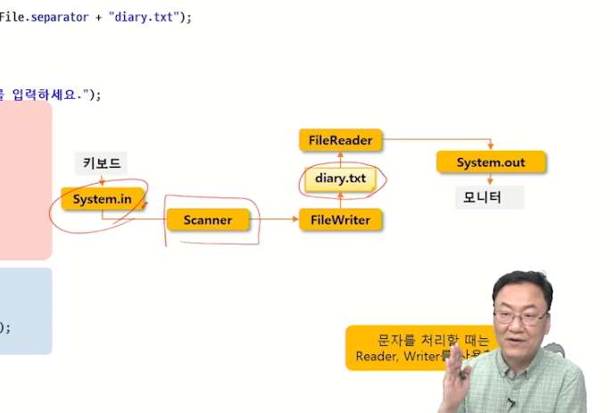

# File I/O
## 노드스트림
### I/O와 Stream
- I/O : 데이터의 입출력
- 데이터는 한쪽에서 주고 한쪽에서 받는 구조로 되어 있다.
    - 입력과 출력의 끝단: 노드
    - 두 노드를 연결하고 데이터를 전송하는 개념: 스트림
    - 스트림은 단방향 통신만 가능하며 하나의 스트림으로 입력과 출력을 같이 처리할 수 없음
---
## 노드 스트림의 종류와 네이밍
- node stream: node에 연결되는 스트림

### InputStream과 Reader()
- read(): 데이터를 읽는다
- close(): 스트림을 종료해 자원을 반납한다 

- byte타입과 char 타입 데이터 읽기 
- 유니코드를 사용하면 한문은 byte로 되어있지 않기에 문제 발생
- 전송되는 데이터가 char 타입이라면 Reader 사용
- byte: 동영상, 이미지, 설치프로그램
- char: 텍스트
### OutputStream과 Writer

### File
- 가장 기본적인 입출력 장치 중 하나로 파일과 디렉터리를 다루는 클래스

- 특정 파일의 경로 참조해보기

#### FileInputStream, FileOutputStream
- String name 대신 File 객체 사용 가능

- node와 사용하는 stream 종류만 달라질 뿐, 사용법은 같다
#### FileReader, FileWriter
- File.separator : 파일 경로 구별자
    - OS의 정성적인 녀석을 날려서 윈도우/맥에서 다 가능하도록 만든다

- Scaaner 클래스 사용할 때 System.in 적은 게 키보드의 입력 값이라니 신기하다
---
## 보조스트림
- 다른 스트림에 부가적인 기능 제공
- Filter Stream, Processing Stream
- Stream Chaining: 필요에 따라 여러 보조 스트림을 연결해서 사용 

- 종료
    - 보조 스트림을 close()하면 노드 스트림까지 close()된다
    - 노드 스트림은 언제나 필요하다
## 스트림 사용 결정 과정
1. 노드가 무엇인가
2. 사용 데이터 타입은?
3. 방향은(읽기/쓰기)
4. 어떤 추가 기능이 필요한가?
- ex) 영화 파일을 빠른 속도로 이동시키기 : 
    - File 노드 -> byte 타입 -> Read/Write -> FileInputStream/FileOutputStream -> BufferedInputStream/BufferedOutputStream
- ex) 키보드에서 유니코드 문자를 안전하고 빠르게 읽기:
    - Keyboard -> byte -> Read -> InputStream System.in -> InputStreamReader(byte를 char로 바꿈) -> BufferedReader
- ex) 메모리 객체를 파일로 저장 
    - File -> byte -> write -> FileOutputStream -> ObjectOutputStream
---
### InputStreamReader & OutputStreamWriter
- byte 기반 스트림을 char 기반으로 변경
    - 문자열을 관리하는데 byte보다 char 단위가 유리
### Buffered 계열
- 스트림의 입/출력 효율을 높이기 위해 버퍼 사용
- 전송받은 데이터를 버퍼에 모아두었다가 처리 
- 전송 + 처리 동시 진행은 성능이 떨어지기 때문

---
## Serializer 객체 직렬화
- 객체를 파일 등에 저장하거나 네트워크로 전송하기 위해 연속적인 데이터로 변환하는 것
- 반대: 역직렬화
### 직렬화 조건
- Serializable 인터페이스 구현
- 클래스의 모든 멤버가 Serializable 인터페이스를 구현
- 직렬화에서 제외하려는 멤버는 transient 선언

- serialVersionUID
    - 클래스의 변경 여부를 파악하기 위한 유일 키

- 직렬화할 때의 UID와 역직렬화할 때의 UID가 다를 경우 예외 발생
- 직렬화되는 객체에 UID가 설정되지 않았을 경우 컴파일러가 자동 생성
    - 멤버 변경으로 컴파일시마다 변경 -> InvalidClassException 초래
- 직렬화되는 객체에 대해 serialVersionUID 설정 권장

- generated : 객체 생성 클래스 구조가 바뀌어도 serialVersionUID가 같아서 에러가 발생하지 않게 된다
- 상황에 따라 UID를 매번 만들거나, 고정하는 것 중 선택

