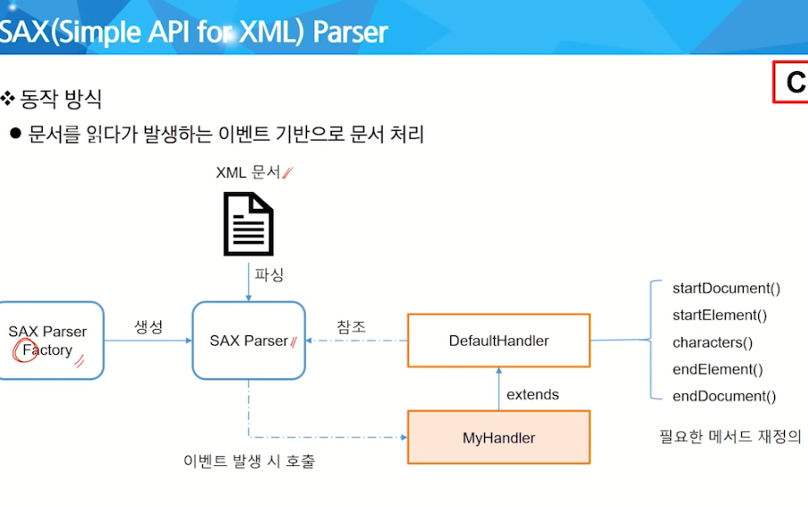
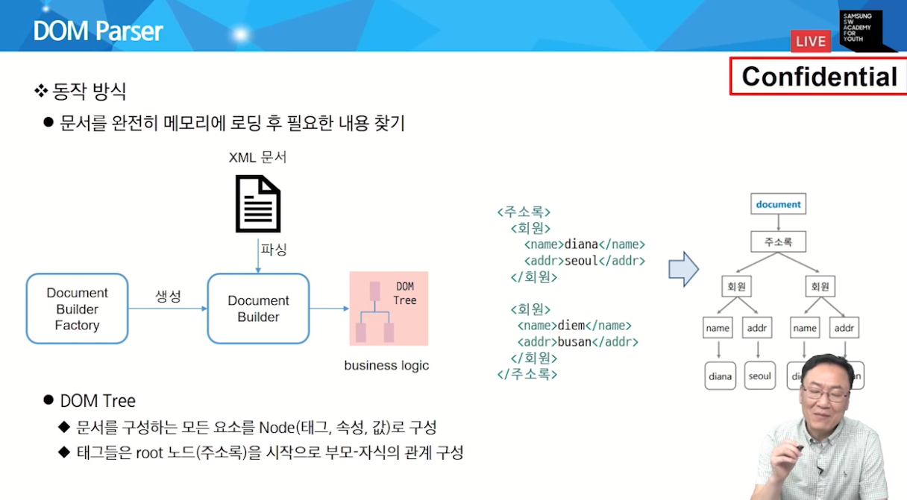
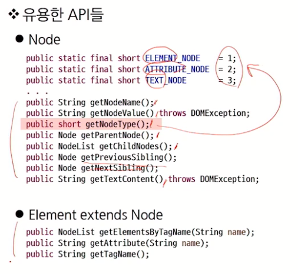

# Parsing
## 공공데이터
- 공공기간이 만드는 공적인 정보
- 누구나 원하는 기능에 활용 가능
### 데이터의 형태
- API
- CSV : comma separated value, ','로 구분, 다른 것에 비해 용량이 적으나 정보 파악이 어려운 구조
- xml : extensible markup lang, 태그를 통해 데이터 형식 정의, 정확한 문법 필요 
- json : javascript object notation, JSON을 통해 데이터 형식 정의, 구조를 가지며 객체로 다른 언어와 호환
---
## xml
- 문서의 시작: <?xml version="1.0" encoding="UTF-8"?>
- 반드시 root element가 존재해야 한다
    - 나머지 태그는 tree 형태로 구성
- 시작 태그와 종료 태그는 일치해야 한다
- 시작 태그는 key-value 구조의 속성을 가질 수 있다
    - 속성 값은 "" or ''로 묶어서 표현
- 태그는 대소문자 구별
- 문법을 잘 준수한 문서를 well-formed라 표현
### valid
- xml 태그는 자유롭게 생성하기 때문에 최초 작성자의 의도대로 작성되었는지 확인 필요
    - 문서의 구조와 적절한 요소, 속성들의 개수, 순서들이 잘 지켜졌는가?
    - DTD 또는 schema를 이용해 문서의 규칙 작성
---
## 파싱
- 문서에서 필요한 정보를 얻기 위해 태그를 구별하고 내용을 추출하는 과정
    - 전문적인 parser 활용
- SAX parser : Simple API for XML parser
    - 문서를 읽으며 태그의 시작, 종료 등 이벤트 기반으로 처리하는 방식
    - 빠르고 한번에 처리하기에 다양한 탐색이 어려움 
- DOM parser : Document Object Model
    - 문서를 다 읽고 난 후 문서 구조 전체를 자료구조에 저장하여 탐색하는 방식
    - 다양한 탐색이 가능하나 느리고 무거워 큰 문서를 처리하기 어려움
### 동작 방식

- 문서를 읽다가 이벤트가 필요하면 그 상황에 맞춰 처리

- 문서를 완전히 메모리 로딩한 후 필요한 내용 찾기

- json : 객체를 key-value 쌍으로 관리