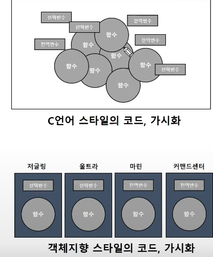
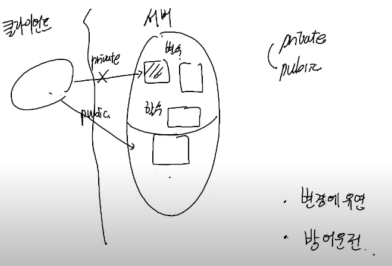
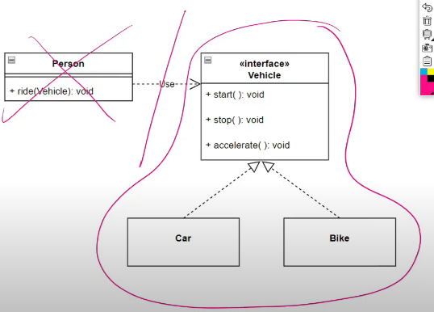

23.11.27
# S/W 품질과 OOAD
[품질이 좋다]
- 분석이 쉽다
- 명확하게 이해할 수 있다
- 유지보수가 효과적이다
- 확장성이 좋고, 변경할 때 유연하다 
- 재사용성이 좋다 

=> 코드리뷰/TDD/Clean Code/문서화

## OOAD
- Object-Oriented Analysis and Design
- 객체 기반으로 개발되는 분석/설계 

## UML
- 객체지향설계의 표준 표기법
- UML Diagram

### 독립적인 역할 수행
```
식당에 요리사/서버/관리자 세 명의 역할이 나뉨
```
- 변경에 유연하다 : 음식 추가되어도 다른 사람에게 영향 x, 서빙 방법을 바꿔도 다른 사람에게 영향 x
- 재사용성이 좋다 : 카페에서 한정식집으로 바꿀 때 요리사만 교체하고 다른 모듈 그대로 재사용 가능

### 클래스

- 클래스를 통해 객체 단위로 구현 
- 변수와 함수를 캡슐화를 해 감싼다

### 언어별 비교
      변수   함수
JAVA  필드    메서드
CPP   멤버데이터 멤버함수
Python 어트리뷰트 


### 서버 코드 & 클라이언트 코드
[Server Code]
- 클라이언트 요청을 받고 처리하는 코드
- 라이브러리 == 서버 코드
[Client Code]
- 서버 코드에게 일을 요청하는 코드
- 라이브러리 사용자 == 클라이언트 코드
```
[CGV] 가격계산-> [영화] 할인 계산-> [할인정책]
[CGV] <-비용--  [영화] <-할인요금-- [할인정책]
```
CGV와 영화에서 클라이언트: CGV, 서버: 영화
영화와 할인정책 클라이언트: 영화, 서버: 할인정책

#### public / private
- public은 외부에 공유한다 
- private는 내부적으로만 이용 가능하다
- 파이썬에서는 public/private가 없다

#### Client들은 Readme를 읽지 않는다
- 서버 코드 레벨에서 접근을 제한할 필요가 있다 : private 처리 
- 파이썬은 '__'를 이용해서 이름을 정하면 실행이 되지 않는다
```py
    def __go(self):
      . . . 
```

### 캡슐화
- 클라이언트에게 공개할 것과 아닌 것을 구별 
- 허용할 데이터 : 필드로만 데이터 제어 가능
- 허용하지 않을 데이터 : 필드 접근을 막아 데이터 보호 
- (장점) 데이터를 내부적으로만 이용할 수 있게 만들 수 있다



### 상속
- 부모가 가진 요소들을 자식이 물려받아 사용 가능 
- OOP 상속 : 코드 중복 방지를 위해 공통적인 요소를 일반화 시킴 


### OVERRIDING & OVERLOADING
- 오버라이딩: 슈퍼 클래스 메서드를 섭 클래스에서 재정의
- 오버로딩: 같은 이름의 메서드지만 다른 argument로 함수 구분 (파이썬에는 없는 개념)
- 부모는 자식을 가리킬 수 있다 

### 클라이언트 코드로 다형성 구현
- 다형성: 어떤 객체의 속성이나 기능이 상황에 따라 여러 형태를 가질 수 있는 성질 
- 오버로딩 또는 오버라이딩으로 구현
- 클라이언트에서는 부모타입을 이용해서 다양한 모듈 장착


### SW Interface
- 언젠가 추가될 유지보수를 위해 확장 가능한 형태로 제작
- 객체를 쉽게 사용하고자 표준화를 시킴
- 인터페이스에 명시된 메서드는 반드시 구현되어야 한다 
- 인터페이스 규격에 따르는 것 : Realization


### UML
- Unified Modeling Language 
- 의사소통을 위한 도구
- 필요한 View만 시각화하여 이해하기 쉽게 보여줌
- 공통 표준 언어로 의사소통에 기여
- 실제 만들어보는 것과 모델을 만드는 것의 비용을 생각해볼 수 있다
- UML은 프로젝트가 완료되었을 때, 가장 확실한 결과물이 나온다 -> 개발 도중 설계 변경이 잦다
```
[쓰임새]
1. 코드 작성 비용 > 모델 작성 비용
2. 조직 내 의사소통
3. 기획 산출물이 완료되었다는 증거 : 임베디드, 항공, 대규모 프로젝트에서 필수
```
struct diagrams & behavior diagrams

#### UML 사용
- draw.io
- 확대, 축소 : 빈 페이지에 enter
- 화면 이동 : 휠 누른 상태로 드래그
```
[표준 규칙]
1. 클래스 이름은 대문자 시작
2. 메서드와 필드는 모두 소문자 시작
3. 메서드 이름은 동사형 
```
- 의미만 전달 잘 된다면 표기할 필요 없는 메서드/필드는 생략 가능 
- << 새로운 의미 부여 >> 형태로 interface 표시

직접 그려보기 


---

23.11.28
## Coupling
- 어떤 모듈이 다른 모듈에 의존하는 정도
- 어떤 객체가 다른 객체를 이용해 나의 동작을 만든다

### 변경하다의 의미
- 소스코드가 요구사항에 의해 수정되는 것
```
1. 메서드/필드 수정 및 제거
2. 메서드/필드 이름 변경
3. 파라미터/ 리턴 값 변경 등등
```
- 의존관계 : 관계
- 의존도: 의존하는 정도
- 변경이 많은 부분에 직접적으로 의존하지 않도록 하자


## UML
- 상속 관계는 수직으로 배치, 그외는 가로 배치
### dependency 관계
- 외부 클래스를 임시적으로 사용, 클래스가 참조를 유지하지 않는다
1. local : 지역 변수로 만들어서 사용
2. parameter : 다른 클래스에 넘겨주는 형태 
3. factory : 가상의 생성자 역할 

### Association & aggregation
- 다른 클래스를 사용하는데 참조를 유지한다 
```
[Association]
- Has a: 소유 정도(세기)가 다르다
- 단순한 배열이면 association 모호하면 aggregation
```

### Composition
- 사람과 심장의 관계 : 반드시 함께 존재해야 한다 (함께 생성, 함께 소멸)
- whole/part 관계

## Sequence Diagram
- 객체의 상호작용 흐름을 알 수 있는 diagram
- lifeline: 시간이 흐르고 있음을 나타냄
- actor: 등장 인물
- 메세지를 시간 순서대로 추가한다
- alternative frame: 분기 타기 -> fragment에 연산 이름 작성
- [guard 절]에 조건을 넣는다
- activation box: 객체 활성 상태
